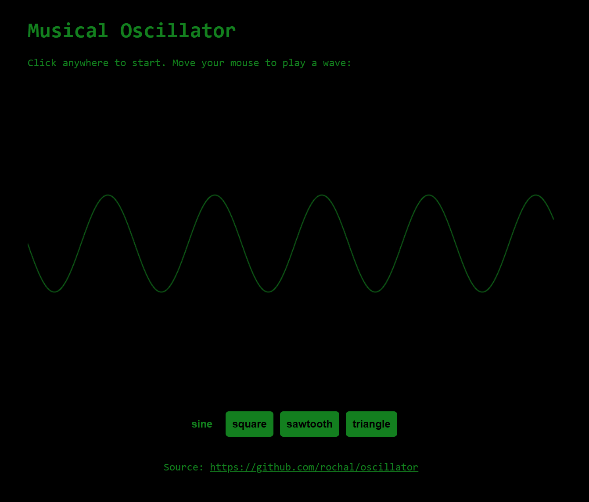

# oscillator
JavaScript sine, square, sawtooth, triangle oscilator wave visualiser written with the help of chatGPT using the AudioContext library.

# demo
https://rochal.github.io/oscillator/

# contact
https://twitter.com/RochalaPiotr